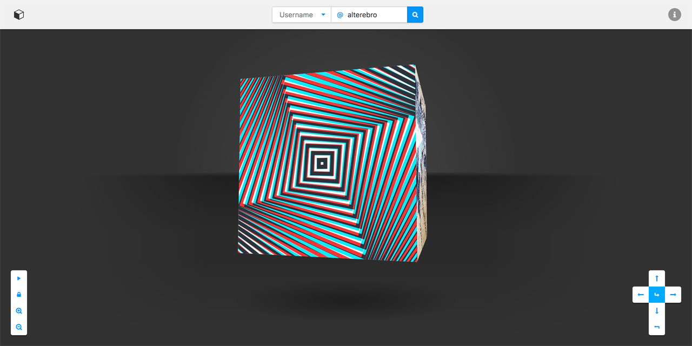

# [InstaCube](https://instacube.moro.es) (instagram-cube)

> Your Instagram feed in a cube!



---


### Install

```sh
$ composer install
$ npm install
```


### Build

```sh
$ gulp create
```

This will create the following files :

	index.html
	/cube/css/cube.min.css
	/cube/js/axios.min.js
	/cube/js/vue.min.js
	/cube/js/cube.min.js


### Deploy

```sh
$ sh upload.sh test # dry-run flagged
$ sh upload.sh sync # rsyncs local copy to server
```

---

*Jorge Moreno &mdash; [@alterebro](https://twitter.com/alterebro)*
